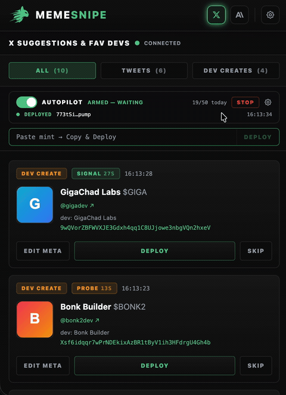
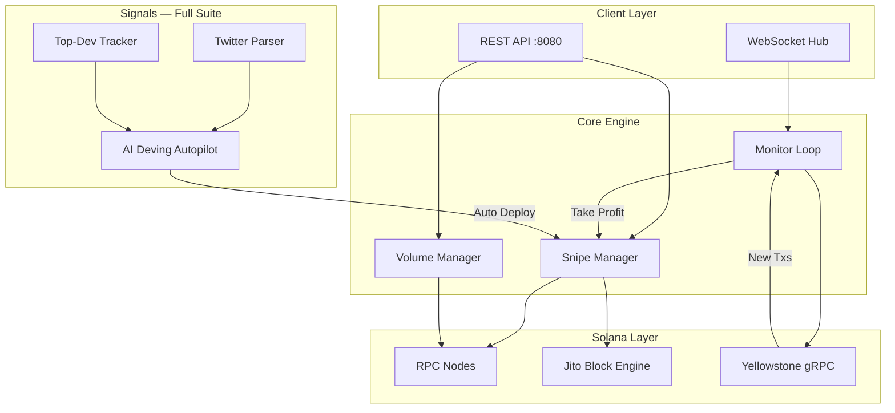

<div align="center">

# ⚡ PumpFun AI Dev Sniper

**AI deving autopilot for pump.fun on Solana — Twitter-driven auto-deploys, top-dev mirroring, and sub-200ms multi-wallet Jito sniping.**

[](https://solana.com)
[](https://go.dev)
[]()

[](https://memesnipe.fun)
[](https://memesnipe.fun)

[Get Access](https://memesnipe.fun) · [Pricing](#pricing) · [Features](#features) · [Demo](#demo) · [Architecture](#architecture)

</div>

---

## What is PumpFun AI Dev Sniper?

A high-performance Go trading bot built for [pump.fun](https://pump.fun) on Solana. Let the AI deving autopilot deploy from your presets the moment a narrative breaks, mirror your favorite top devs automatically, react to real-time Twitter signals, and snipe new launches across multiple wallets with MEV-protected Jito bundles — all through a clean REST API.

Built for traders who need sub-second execution on memecoin launches, shipped as the **full source code** with a lifetime license.

---

## Pricing

Two one-time licenses. Pay once in **SOL**, own the source forever — no subscriptions, no rebilling.

| | **Core** · 9 SOL | **Full Suite** · 15 SOL |
|---|:---:|:---:|
| Full source code + lifetime license | ✅ | ✅ |
| Multi-wallet coordinated sniping | ✅ | ✅ |
| Jito MEV bundle protection | ✅ | ✅ |
| Auto take-profit / stop-loss | ✅ | ✅ |
| Real-time WebSocket monitoring | ✅ | ✅ |
| Bonding-curve trading engine | ✅ | ✅ |
| Volume bot strategies | ✅ | ✅ |
| "Eyes on Axiom" overlay | ✅ | ✅ |
| **Twitter / X real-time parsing** | — | ✅ |
| **Top-dev tracking & mirroring** | — | ✅ |
| **AI Deving autopilot** | — | ✅ |
| **pump.fun Token Creator** | — | ✅ |
| Support | Standard | Priority |

<div align="center">

[](https://memesnipe.fun)
&nbsp;
[](https://memesnipe.fun)

**Pay with 300+ cryptocurrencies · Instant delivery · 24/7 support on Telegram**

</div>

---

## Features

**In every tier (Core + Full Suite):**

- **Multi-Wallet Coordinated Sniping** — Atomic launches with parallel RPC buys across wallets. Fastest entry on new pump.fun tokens.
- **Jito MEV Bundle Protection** — Batch transactions through Jito's private mempool. Zero front-running, minimal slippage.
- **Real-Time WebSocket Monitoring** — Live transaction streaming with automated take-profit and stop-loss triggers.
- **Bonding Curve Trading** — Fast on-chain price calculations without RPC lookups. Deterministic, low-latency execution.
- **Volume Bot Strategies** — Automated buy/sell cycles across wallets to generate organic-looking volume on pump.fun tokens.
- **"Eyes on Axiom" Overlay** — Compact side-by-side layout with real-time wallet/token visibility and one-click CA copy.
- **REST API Control** — Full HTTP API for programmatic control. Integrate with your own dashboard or scripts.

**Full Suite only (15 SOL):**

- **Twitter / X Parsing** — Live feed parsing surfaces the relevant tweet the instant news breaks — never miss the narrative.
- **Top-Dev Tracking** — Follow and mirror your favorite creators automatically the moment they deploy.
- **AI Deving Autopilot** — Semi-manual signals or fully automatic deploys driven by Twitter signals and top devs.
- **pump.fun Token Creator** — Create and launch tokens with full metadata in seconds.

> See [FEATURES.md](FEATURES.md) for detailed breakdown with API examples.

---

## Demo

<div align="center">

| Instant Token Launch | Interactive Design | Fast Copying |
|:---:|:---:|:---:|
|  |  |  |
| Deploy to pump.fun in seconds | Premium trading interface | One-click wallet and CA copying |

</div>

---

## AI Deving & Auto-Sell in Action

<div align="center">

| 🤖 AI Deving Autopilot | 📈 Monitor & Auto-Sell |
|:---:|:---:|
|  |  |
| Twitter signals & top-dev deploys fire the autopilot from your presets | Real-time position monitoring with ladder take-profit / stop-loss |

</div>

---

## Perfect Side-by-Side

Our deeply optimized compact design is built to snap cleanly alongside your favorite analytics platform.

> Keep **Axiom, GMGN,** or any other chart open while keeping full control of your snipes in **1/3 perfectly scaled screen real-estate.**


---

## Architecture



---

## How It Works

```
1. Monitor    → Yellowstone gRPC streams all pump.fun transactions in real-time
2. Detect     → New token launch detected, bonding curve parsed
3. Evaluate   → Market cap, liquidity, creator history checked in <50ms
4. Signal     → (Full Suite) Twitter + top-dev signals feed the AI deving autopilot
5. Execute    → Multi-wallet snipe via Jito bundle OR parallel RPC
6. Manage     → Auto take-profit/stop-loss via WebSocket monitoring
```

---

## Code Preview

### Bonding Curve Data Structure
```go
type BondingCurve struct {
    VTR, VSR, RTR, RSR, TTS uint64
    Complete                bool
    Creator                 solana.PublicKey
    IsCashbackCoin          bool
}
```

### Snipe Request API
```go
type SnipeFireRequest struct {
    TokenID     string   `json:"tokenId"`
    Wallets     []string `json:"wallets"`
    BuyPercent  float64  `json:"buyPercent"`
    SlippageBps uint16   `json:"slippageBps"`
    DevBuySOL   float64  `json:"devBuySOL"`
}

type BundleSnipeFireRequest struct {
    TokenID            string   `json:"tokenId"`
    Wallets            []string `json:"wallets"`
    JitoTipSOL         float64  `json:"jitoTipSOL"`
    RpcFallbackDelayMs int64    `json:"rpcFallbackDelayMs"`
}
```

### Real-Time Monitor
```go
type MonitorState struct {
    TokenID    string
    CreatedAt  time.Time
    LastTxTime time.Time
    TxCount    int64
    Profit     float64
}

type wsHub struct {
    mu        sync.RWMutex
    clients   map[string]map[*wsClient]bool
    broadcast chan wsMessage
}
```

---

## Performance

| Metric | Value |
|--------|-------|
| Snipe latency (RPC) | ~150ms |
| Snipe latency (Jito bundle) | ~200ms |
| WebSocket event processing | <10ms |
| Concurrent wallets | Up to 20 |
| Uptime (production) | 99.9% |

---

## Getting Started

PumpFun AI Dev Sniper ships as the **full source code** with a lifetime license.

### Quick Start
1. **Pick your tier** and pay at [memesnipe.fun](https://memesnipe.fun) — 9 SOL (Core) or 15 SOL (Full Suite)
2. Message **[@nik0dev](https://t.me/nik0dev)** on Telegram with your order ID
3. Receive your private GitHub invite (or the source files directly)
4. Self-host your instance, configure wallets and presets, and start sniping

---

## API Endpoints

| Method | Endpoint | Description | Tier |
|--------|----------|-------------|------|
| POST | `/api/snipe/fire` | Execute multi-wallet snipe | Core |
| POST | `/api/snipe/bundle-fire` | Execute Jito bundle snipe | Core |
| POST | `/api/volume/start` | Start volume bot cycle | Core |
| POST | `/api/sell/bundle` | Bundle sell across wallets | Core |
| GET  | `/api/monitor/ws` | WebSocket monitoring stream | Core |
| GET  | `/api/token/:id` | Token bonding curve data | Core |
| POST | `/api/deving/arm` | Arm the AI deving autopilot | Full Suite |
| POST | `/api/token/create` | Launch a pump.fun token | Full Suite |

> Full API reference with curl examples in [FEATURES.md](FEATURES.md)

---

## FAQ

**Do I get the source code?**
Yes. Both tiers include the complete source under a commercial lifetime license. This public repo holds documentation, architecture, and code previews; purchasing grants access to the private source repository.

**What's the difference between Core and Full Suite?**
Core (9 SOL) is the complete sniping engine — Jito bundles, auto take-profit, WebSocket monitoring, volume bot, and the Axiom overlay. Full Suite (15 SOL) adds Twitter parsing, top-dev tracking, the AI deving autopilot, the Token Creator, and priority support.

**Can I upgrade later?**
Yes — pay the 6 SOL difference and message [@nik0dev](https://t.me/nik0dev) with your order ID to unlock the Full Suite.

**What chains are supported?**
Solana only, specifically optimized for pump.fun token launches.

**How fast is the sniper?**
Sub-200ms from token detection to buy execution with Jito bundles. Under 150ms with direct RPC.

---

## Get Access

<div align="center">

### Ready to snipe pump.fun launches?

[](https://memesnipe.fun)
&nbsp;
[](https://memesnipe.fun)

**Pay with 300+ cryptocurrencies · Instant delivery · 24/7 support on Telegram**

</div>

---

## Disclaimer

This software is provided for educational and research purposes. Trading cryptocurrencies involves significant risk. Past performance does not guarantee future results. Users are responsible for compliance with local regulations. The developers are not liable for financial losses incurred through use of this software.

---

<div align="center">
<sub>Built with Go · Powered by Solana · Protected by Jito</sub>
</div>
